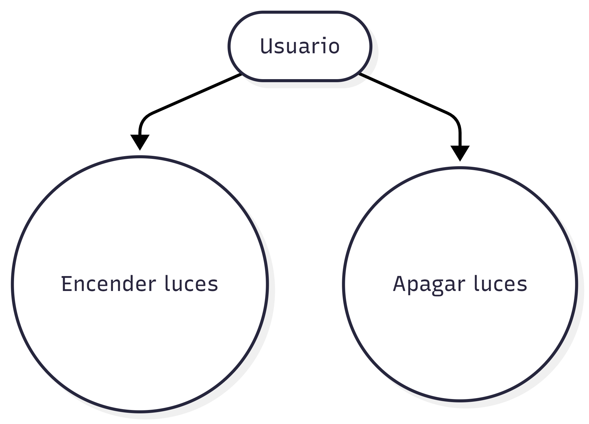

# Entornos-7.2

## Ejercicio 1 – Sistema de Iluminación Inteligente

En este ejercicio se representa un único actor (Usuario) que puede encender y apagar las luces.

## Ejercicio 2 – Gestión de Tienda Online

En este ejercicio se muestra cómo el caso de uso “Aplicar Cupón Descuento” es opcional y por tanto se modela como una extensión de “Comprar Producto”.
